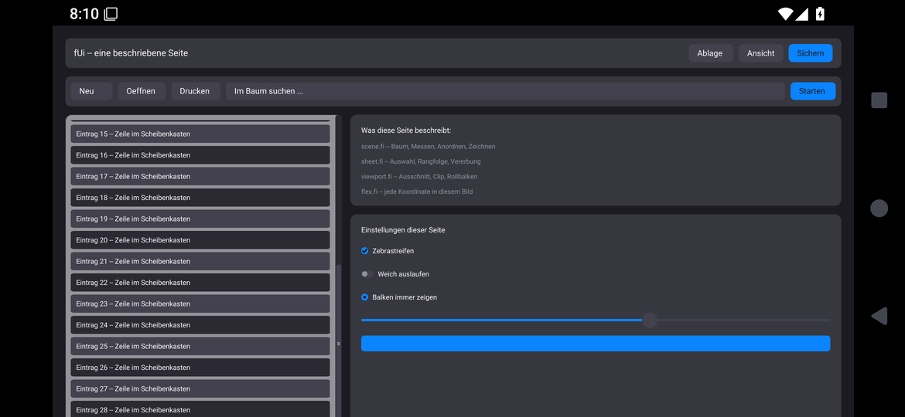

# Firn on Android

A Firn program that opens its window through `lib/window/window.fi` runs as a
native Android app. No Java, no Kotlin, no Gradle, no Play Store:
`android.app.NativeActivity` is part of Android, and everything behind it is
Firn.

```sh
bash tools/android/build.sh demos/x11demo/main.fi --name "fUi Galerie" \
    --package org.firn.gallery            # -> build/android/fui_galerie/*.apk
adb install -r build/android/fui_galerie/fui_galerie.apk
```

The entry file is the one that runs under X11. `build.sh` builds it from a
shadow of its directory in which `window/backend.fi` points to
`lib/window/android.fi`, compiles with `--pic` for arm64-v8a and x86_64,
links a `.so` that exports only `firn_activity_create`, writes the manifest
and signs with a key kept in `~/.firn/android.keystore` (keep it: an update
needs the same key).

## The pieces

| File | What it does |
|---|---|
| `lib/android/activity.fi` | The host. Starts one pthread that runs `gc_init` and the program's `main`; Android's main thread only forwards window, input queue, content rectangle, configuration and lifecycle and waits for the acknowledgement where Android needs it. `args.txt` in the app's data directory becomes argv, stdout/stderr go to `stdout.txt` there. |
| `lib/android/ndk.fi` | The NDK functions and C layouts (from Certus, MPL-2.0). |
| `lib/window/android.fi` | The window backend: in host mode it pumps the app thread's looper, turns touches and keys into window events, maps Android density to design points (160 dpi = 1.0) and shows the program only the part of the window that no status bar, navigation bar or cutout covers. |
| `lib/plat/sysfont.fi` | The system face: DejaVu on Linux, Roboto on Android. |
| `tools/android/build.sh` | Any entry file -> APK. |
| `tools/android/gallery_check.sh` | The acceptance run on a device or emulator. |

## Measured (emulator, Android 15 x86_64, 23.09.2026)

`tools/android/gallery_check.sh`: 14 of 14 checks -- touch toggles switch and
checkbox, "Starten" runs the progress animation, Tab/Enter, PageDown scrolls,
rotation, home and back again, Back ends `main` and the process, no crash.
A full frame of the gallery (2072 x 1014) takes 885 ms to paint in the
emulator (median of 22). The protocol splits one frame: 884 ms fUi painting,
10 ms RGBA -> BGRX, 62 ms into the window buffer (`r_image` swaps octet by
octet; the double conversion RGBA -> BGRX -> RGBA is a known waste).



## Notifications and push without Firebase

```sh
bash tools/android/build.sh demos/pushdemo/main.fi --name "Firn Push" \
    --package org.firn.pushdemo --push
python3 tools/android/relay_test.py 7790          # stand-in relay on the host
bash tools/android/push_check.sh                  # 8 checks on the emulator
```

`--push` has Firn WRITE the one Java class a foreground service needs:
`tools/android/servicedex_main.fi` produces a 828-octet `classes.dex` with
`org.firn.FirnService` (static initialiser `System.loadLibrary`, constructor,
three `native` methods) through `lib/android/dex.fi`; no javac, no d8.
`lib/plat/android/push.fi` implements those natives and the program side:

* `push_start(host, port)` writes `firn-push.cfg`, asks for
  POST_NOTIFICATIONS on Android 13+, starts the service
  (`foregroundServiceType="remoteMessaging"`) and keeps the program alive
  when the activity goes away (`activity_keep_alive`).
* The service starts a pthread that holds ONE TCP connection to the relay
  and posts one notification per line; it reconnects every 3 s and runs
  without the activity (after Back, or when Android restarts the service).
* `push_notify(title, text)` posts a notification from the program.
* All of it is `#[no_gc]` and calls Java through `lib/android/jnicall.fi`.

Measured on the emulator: foreground service with type 0x200, three lines ->
three notifications (umlauts intact), Back -> activity gone, same process,
relay restarted -> reconnect -> notification, tap on it -> the same program
gets its window back; the permission dialog appears when the permission is
missing. Firn's checked cast caught `checkSelfPermission` = -1 as
`u64 as i32` on the way -- `jnicall.jint` sign-extends now.

## FIRNCHAT on Android (r64)

```sh
bash tools/android/build.sh <firnchat>/src/gui/app.fi --name FirnChat \
    --package org.firn.firnchat --push --args-file firnchat-args.txt
bash tools/android/firnchat_check.sh <firnchat>   # 10 checks, own test relay
```

The same `src/gui/app.fi` as on the desktop (FIRNCHAT branch `android`):
the build leaves FIRNCHAT's vendored X11 window layer out and uses
lib/window with the Android backend. The push is FIRNCHAT's own live relay
session -- end to end encrypted, no Firebase: `window.stay_alive` keeps the
process through the foreground service after Back, `window.notify` shows
"N neue Nachricht(en)" while `window.in_front` is false. The working
directory is the app's files directory (the identity `firnchat.id` lands
there), and `--args-file` ships the relay address as assets/args.txt.
To reach the relay the firnc targets `x86_64-android`/`aarch64-android`
write the legacy system calls as `*at` forms (Android's seccomp filter
killed the app on chmod and dup2).

## Open

* The soft keyboard composes nothing yet (no InputConnection without a dex
  class); hardware keys and the key events Android synthesises arrive.
* A finger drag does not scroll: fUi scrolls by scroll bar, wheel and keys.
* Only tested in the emulator; the arm64 build still needs a real phone.
* Push: the relay address is a dotted IPv4 address (no name lookup), the
  connection is plain TCP (no TLS yet), one line = one message.
* FIRNCHAT's desktop layout is not a phone layout (fixed side bar).
* aarch64 still lacks stat/lstat/pipe/rmdir/readlink forms (compile error
  when a program uses them, not a silent guess).
