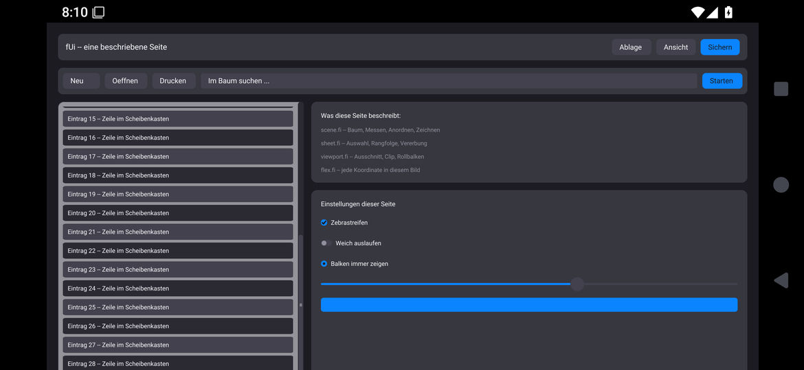

# Firn on Android

A Firn program that opens its window through `lib/window/window.fi` runs as a
native Android app. No Java, no Kotlin, no Gradle, no Play Store:
`android.app.NativeActivity` is part of Android, and everything behind it is
Firn.

```sh
bash tools/android/build.sh demos/x11demo/main.fi --name "fUi Galerie" \
    --package org.firn.gallery            # -> build/android/fui_galerie/*.apk
adb install -r build/android/fui_galerie/fui_galerie.apk
```

The entry file is the one that runs under X11. `build.sh` builds it from a
shadow of its directory in which `window/backend.fi` points to
`lib/window/android.fi`, compiles with `--pic` for arm64-v8a and x86_64,
links a `.so` that exports only `firn_activity_create`, writes the manifest
and signs with a key kept in `~/.firn/android.keystore` (keep it: an update
needs the same key).

## The pieces

| File | What it does |
|---|---|
| `lib/android/activity.fi` | The host. Starts one pthread that runs `gc_init` and the program's `main`; Android's main thread only forwards window, input queue, content rectangle, configuration and lifecycle and waits for the acknowledgement where Android needs it. `args.txt` in the app's data directory becomes argv, stdout/stderr go to `stdout.txt` there. |
| `lib/android/ndk.fi` | The NDK functions and C layouts (from Certus, MPL-2.0). |
| `lib/window/android.fi` | The window backend: in host mode it pumps the app thread's looper, turns touches and keys into window events, maps Android density to design points (160 dpi = 1.0) and shows the program only the part of the window that no status bar, navigation bar or cutout covers. |
| `lib/plat/sysfont.fi` | The system face: DejaVu on Linux, Roboto on Android. |
| `tools/android/build.sh` | Any entry file -> APK. |
| `tools/android/gallery_check.sh` | The acceptance run on a device or emulator. |
| `lib/plat/android/pick.fi` | A photo from the gallery or the camera, pictures into pixels (see below). |

## Measured (emulator, Android 15 x86_64, 23.09.2026)

`tools/android/gallery_check.sh`: 14 of 14 checks -- touch toggles switch and
checkbox, "Starten" runs the progress animation, Tab/Enter, PageDown scrolls,
rotation, home and back again, Back ends `main` and the process, no crash.
A full frame of the gallery (2072 x 1014) takes 885 ms to paint in the
emulator (median of 22). The protocol splits one frame: 884 ms fUi painting,
10 ms RGBA -> BGRX, 62 ms into the window buffer (`r_image` swaps octet by
octet; the double conversion RGBA -> BGRX -> RGBA is a known waste).



## Notifications and push without Firebase

```sh
bash tools/android/build.sh demos/pushdemo/main.fi --name "Firn Push" \
    --package org.firn.pushdemo --push
python3 tools/android/relay_test.py 7790          # stand-in relay on the host
bash tools/android/push_check.sh                  # 8 checks on the emulator
```

`--push` has Firn WRITE the one Java class a foreground service needs:
`tools/android/servicedex_main.fi` produces a 828-octet `classes.dex` with
`org.firn.FirnService` (static initialiser `System.loadLibrary`, constructor,
three `native` methods) through `lib/android/dex.fi`; no javac, no d8.
`lib/plat/android/push.fi` implements those natives and the program side:

* `push_start(host, port)` writes `firn-push.cfg`, asks for
  POST_NOTIFICATIONS on Android 13+, starts the service
  (`foregroundServiceType="remoteMessaging"`) and keeps the program alive
  when the activity goes away (`activity_keep_alive`).
* The service starts a pthread that holds ONE TCP connection to the relay
  and posts one notification per line; it reconnects every 3 s and runs
  without the activity (after Back, or when Android restarts the service).
* `push_notify(title, text)` posts a notification from the program.
* All of it is `#[no_gc]` and calls Java through `lib/android/jnicall.fi`.

Measured on the emulator: foreground service with type 0x200, three lines ->
three notifications (umlauts intact), Back -> activity gone, same process,
relay restarted -> reconnect -> notification, tap on it -> the same program
gets its window back; the permission dialog appears when the permission is
missing. Firn's checked cast caught `checkSelfPermission` = -1 as
`u64 as i32` on the way -- `jnicall.jint` sign-extends now.

## FIRNCHAT on Android (r64)

```sh
bash tools/android/build.sh <firnchat>/src/gui/app.fi --name FirnChat \
    --package org.firn.firnchat --push --args-file firnchat-args.txt
bash tools/android/firnchat_check.sh <firnchat>   # 10 checks, own test relay
```

The same `src/gui/app.fi` as on the desktop (FIRNCHAT branch `android`):
the build leaves FIRNCHAT's vendored X11 window layer out and uses
lib/window with the Android backend. The push is FIRNCHAT's own live relay
session -- end to end encrypted, no Firebase: `window.stay_alive` keeps the
process through the foreground service after Back, `window.notify` shows
"N neue Nachricht(en)" while `window.in_front` is false. The working
directory is the app's files directory (the identity `firnchat.id` lands
there), and `--args-file` ships the relay address as assets/args.txt.
To reach the relay the firnc targets `x86_64-android`/`aarch64-android`
write the legacy system calls as `*at` forms (Android's seccomp filter
killed the app on chmod and dup2).

### Push like a messenger (25.09.2026)

```sh
bash tools/android/firnchat_push_check.sh <firnchat> <apk>   # 24 checks
```

* **One notification per chat** (`window.notify_at(f, key, ...)`, key =
  the row): the sender's chat as title ("Alice", "#kanal", "Alice (3)" for
  three unread), the newest line as text -- an emoji survives (JNI gets
  modified UTF-8: a four octet character goes over as a surrogate pair).
  Channel `firn_msg` "Nachrichten": importance high (heads-up), the
  default sound, vibration allowed -- what really rings follows the
  phone's own settings. The old channel `firn_push` (made without
  vibration, and Android keeps a channel as it was made) is deleted.
* **Our own group with a summary.** Android bundles the notifications of
  one app by itself, and a tap on a line of ITS bundle is a tap on its
  summary: the message stays and nobody can tell which chat was meant
  (measured, API 35). In our group a heads-up or a line of the expanded
  bundle is the message itself.
* **The tap opens that chat, without a Java class.** A tapped
  notification is auto-cancelled, so when the window comes back the
  program asks which of its notifications are gone
  (`window.notify_shown`: `NotificationManager.getActiveNotifications`)
  -- the newest gone one is the chat to open. Android removes it a moment
  AFTER the activity is resumed, so the question is asked for 2.5 s.
  `window.notify_cancel` takes a chat's notification away once it is read.
* **Nothing is painted while the window is not in front** -- a picture
  painted into no surface put glyphs into fUi's atlas bookkeeping that
  never reached the GPU (letters missing after coming back).
* **The relay comes back by itself:** a dead live session is reopened
  after 1 s, then 4 s doubling up to 60 s, with everything read again;
  what came meanwhile is notified from the unread counts.
* Measured on the emulator (API 35): Home, Back, swiped out of the recent
  apps -- the foreground service keeps the process and the notification
  comes; relay restarted -> live again after 6 s.

Found on the way, a compiler bug (fixed, `tests/1901_bool_cell_thread_reuse.fi`):
`thread-bool` threaded a bool cell whose load was reused later as the value
of the variable; in release-safe `let fr = window.in_front(f)` read false
forever.

## A photo from the gallery or the camera (25.09.2026)

```sh
bash tools/android/build.sh <firnchat>/src/gui/app.fi --name FirnChat \
    --package org.firn.firnchat --push --pick --args-file firnchat-args.txt
bash tools/android/firnchat_image_check.sh <firnchat> <apk>   # 25 checks
```

A NativeActivity cannot receive another app's answer (onActivityResult is a
Java method of the activity that asked). So `--pick` puts a second class,
`org.firn.FirnPick`, into the classes.dex Firn writes
(`tools/android/servicedex_main.fi`): an invisible, translucent activity
whose `onCreate` calls the native `pick()` and whose `onActivityResult` is
native too (`lib/plat/android/pick.fi`). It opens the system's chooser --
the photo picker for `image/*` and the camera beside it (the camera writes
into a MediaStore entry made for it; neither needs a permission). The
chosen photo is decoded by BitmapFactory (down-sampled first), turned
upright by its EXIF orientation, scaled to at most 1600 px and compressed
to a JPEG of at most 190 kB -- what the page does in the browser before it
sends. The program's thread picks it up with `window.pick_poll` /
`window.pick_take`; `window.image_decode` turns JPEG/PNG/WebP octets into
RGBA pixels of a given size (cut to that shape, like CSS `cover`).
On X11, Windows and Osum all three honestly say no (`pick_poll` -1).

FIRNCHAT uses it the page's way: the photo waits as a thumbnail over the
input line, the x takes it away, text can be written to it, Send puts out
one message. The photo itself goes through the relay (FIRNCHAT
`src/blob.fi`: sealed pieces, stored where the page's server keeps its
pictures), so page and app see the same photos.

* Measured on the emulator (API 35): gallery photo 2400x1800 -> 1600x1200
  JPEG, 132 kB; camera photo 1200x1600; a red photo sent from another
  account painted in its bubble; Back in the chooser sends nothing.

## Open

* The soft keyboard composes nothing yet (no InputConnection without a dex
  class); hardware keys and the key events Android synthesises arrive.
* A finger drag does not scroll: fUi scrolls by scroll bar, wheel and keys.
* Only tested in the emulator; the arm64 build still needs a real phone.
* Push: the relay address is a dotted IPv4 address (no name lookup), the
  connection is plain TCP (no TLS yet), one line = one message.
* Push after a phone restart or after Android killed the process: the
  service comes back (START_STICKY) but the program does not -- no
  BOOT_COMPLETED receiver, no headless start of the program yet. Opening
  the app once brings everything back.
* A tap on the COLLAPSED bundle of several chats opens the newest chat
  (the summary takes the whole group with it).
* FIRNCHAT's desktop layout is not a phone layout (fixed side bar).
* aarch64 still lacks stat/lstat/pipe/rmdir/readlink forms (compile error
  when a program uses them, not a silent guess).

## The on-screen keyboard (r114)

A keyboard never types into a plain `NativeActivity`: the input method asks
the focused view for an `InputConnection`, the `NativeContentView` answers
null and Android logs "showSoftInput() ignored: view is not served". So
`lib/android/inputmethod.fi` builds two Java classes as DEX in memory
(`lib/android/imedex.fi`: `org.firn.ImeView`, a one pixel view that holds the
focus, and `org.firn.ImeConn`, an `InputConnection` whose methods are all
`native`), loads them with an `InMemoryDexClassLoader` and registers Firn
functions for the natives. It happens the first time a text field takes the
focus; nothing is built before.

* **Two threads.** Android's main thread owns the views and receives the
  keyboard's calls (`commitText`, `setComposingText`, `getTextBeforeCursor`,
  ...). The program lives on the app thread (`lib/android/activity.fi`) and
  owns the text (`lib/fui/textbuf.fi`). A native method copies its arguments
  into a request in shared raw memory, wakes the app thread (`CMD_IME`) and
  waits at most 400 ms; the app thread does the edit on the real `TextBuf`
  (`ime_serve`) and the answer goes back. What needs the main thread (build,
  focus, show, hide, `updateSelection`) is posted the other way, one octet
  into a socket pair whose end hangs in the main looper.
* **Program side.** `window.text_input(f, on, secret, tb)` and
  `window.text_sync(f, tb)` (lib/window/window.fi); `fui.app` does it for
  its text fields (`lib/@linux/fui/apphost.fi`). A desktop back end answers
  `false` / 0.
* **Checks.** `tools/android/ime_dex_check.sh` (the SDK's `dexdump` reads the
  classes, part of `tools/fui/run.sh`), `tools/android/keyboard_check.sh`
  (emulator: taps the keys of the real keyboard, compares the pixels with
  the same text arriving as key events) and `tools/android/lifecycle_check.sh`
  (pause, resume, rotation, screen off).
* **Not done:** a real phone (the emulator's AOSP keyboard is what was run),
  more than one line of text, the full-screen extract UI (the flags ask the
  keyboard not to use it).
* **A bug it found on the way** (roadmap r113): a call through a `fn(f64, f64,
  f64, f64)` value at `release-safe` on x86_64 put the floats in the wrong
  registers (the register allocated path of `Op::CallIndirect` counted every
  argument as an integer). The GL clear colour arrived as (b, 0, 0, 0) and the
  Android window kept its old texture. Fixed in `compiler/src/regalloc.rs`,
  checked by `tests/2002_fnval_float.fi`.
